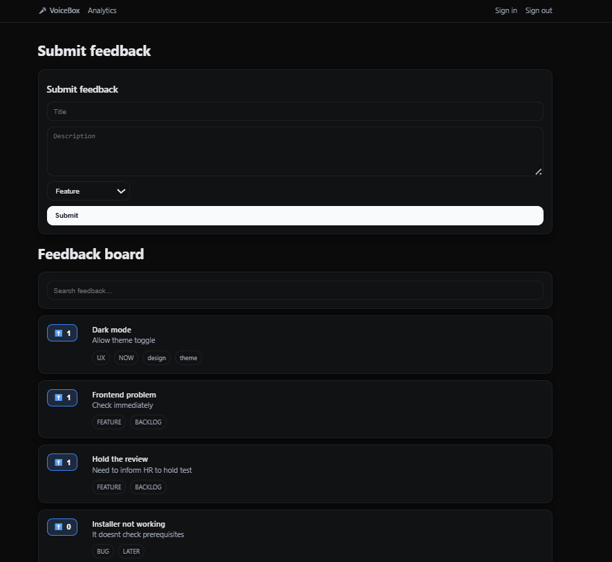

# 🎤 VoiceBox – Customer Feedback App

A lightweight customer feedback management app where users can **sign in with GitHub**, submit feedback & feature requests, and upvote ideas from others.  
Admins can update the **status** of each item (Backlog → Now → Next → Later → Done).  
Analytics dashboards show feedback trends by category and status.  

 Built with **Next.js (App Router)**, **Prisma + Neon Postgres**, and **NextAuth**, deployed on **Vercel**.

---

## ✨ Features
- 🔑 **GitHub login** via NextAuth
- 💡 Submit new feedback / feature requests
- 👍 Upvote existing feedback : One upvote per user (prevents spam voting)
- 👩‍💼 Product managers can update status (Backlog → Now → Next → Later → Done) through Neon Console (Neon PostgreSQL) 
- 📊 Track progress with statuses (Backlog, Now, Next, Later, Done)
- **Analytics Dashboard** –  
  - Bar chart: Items by status  
  - Pie chart: Items by category  
- 🎨 Clean UI with feedback cards, tags, and filters

---

## 🛠️ Tech Stack
- **Frontend:** Next.js 15 (App Router), React
- **Backend:** Prisma ORM + Neon Postgres
- **Auth:** NextAuth.js (GitHub OAuth)
- **Charts:** React Chart.js 2
- **Deployment:** Vercel

---

## 📸 Screenshots

### Home / Feedback Board


###  Analytics


###  Analytics


*(Put your actual screenshots inside a `screenshots/` folder in the repo.)*

---

##  Local Development Setup

### 1. Clone the repo
```bash
git clone https://github.com/harshini1504/VoiceBox.git
cd VoiceBox
```
### 2. Install dependencies
```bash
npm install
```
### 3. Setup environment variables
Create a .env.local in the project root:
```
DATABASE_URL="postgresql://<your-neon-db-url>"
NEXTAUTH_URL="http://localhost:3000"
NEXTAUTH_SECRET="your-secret-key"

GITHUB_ID="your-oauth-client-id"
GITHUB_SECRET="your-oauth-client-secret"
```
### 4. Setup database
```bash
npx prisma migrate dev
npx prisma generate
```
### 5. Run locally
```bash
npm run dev
```

Now open → http://localhost:3000
 🎉
